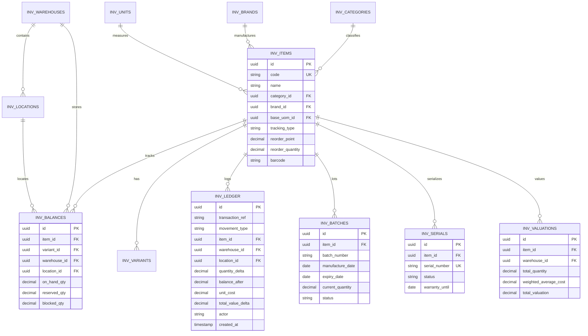

# Inventory Module Entity Relationship Diagram (ERD)

```mermaid
erDiagram
    INV_CATEGORIES ||--o{ INV_ITEMS : "classifies"
    INV_BRANDS ||--o{ INV_ITEMS : "manufactures"
    INV_UNITS ||--o{ INV_ITEMS : "measures"
    INV_ITEMS ||--o{ INV_VARIANTS : "has"
    INV_WAREHOUSES ||--o{ INV_LOCATIONS : "contains"
    INV_ITEMS ||--o{ INV_BALANCES : "tracks"
    INV_WAREHOUSES ||--o{ INV_BALANCES : "stores"
    INV_LOCATIONS ||--o{ INV_BALANCES : "locates"
    INV_ITEMS ||--o{ INV_LEDGER : "logs"
    INV_ITEMS ||--o{ INV_BATCHES : "lots"
    INV_ITEMS ||--o{ INV_SERIALS : "serializes"
    INV_ITEMS ||--o{ INV_VALUATIONS : "values"

    INV_ITEMS {
        uuid id PK
        string code UK
        string name
        uuid category_id FK
        uuid brand_id FK
        uuid base_uom_id FK
        string tracking_type
        decimal reorder_point
        decimal reorder_quantity
        string barcode
    }

    INV_BALANCES {
        uuid id PK
        uuid item_id FK
        uuid variant_id FK
        uuid warehouse_id FK
        uuid location_id FK
        decimal on_hand_qty
        decimal reserved_qty
        decimal blocked_qty
    }

    INV_LEDGER {
        uuid id PK
        string transaction_ref
        string movement_type
        uuid item_id FK
        uuid warehouse_id FK
        uuid location_id FK
        decimal quantity_delta
        decimal balance_after
        decimal unit_cost
        decimal total_value_delta
        string actor
        timestamp created_at
    }

    INV_VALUATIONS {
        uuid id PK
        uuid item_id FK
        uuid warehouse_id FK
        decimal total_quantity
        decimal weighted_average_cost
        decimal total_valuation
    }

    INV_BATCHES {
        uuid id PK
        uuid item_id FK
        string batch_number
        date manufacture_date
        date expiry_date
        decimal current_quantity
        string status
    }

    INV_SERIALS {
        uuid id PK
        uuid item_id FK
        string serial_number UK
        string status
        date warranty_until
    }
```
