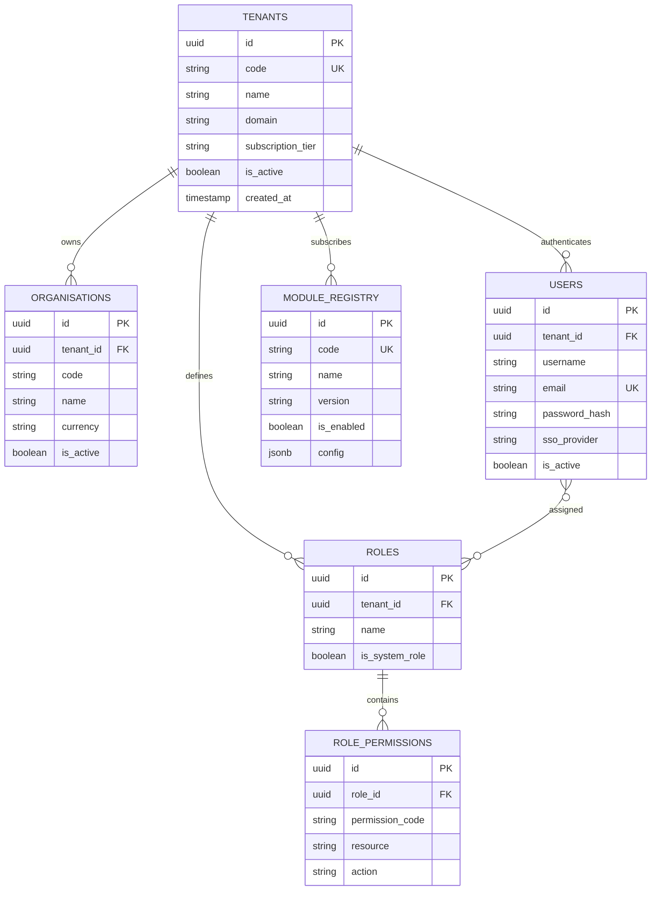

# Platform Entity Relationship Diagram (ERD)

```mermaid
erDiagram
    TENANTS ||--o{ ORGANISATIONS : "owns"
    TENANTS ||--o{ USERS : "authenticates"
    TENANTS ||--o{ ROLES : "defines"
    ROLES ||--o{ ROLE_PERMISSIONS : "contains"
    USERS }o--o{ ROLES : "assigned"
    TENANTS ||--o{ MODULE_REGISTRY : "subscribes"

    TENANTS {
        uuid id PK
        string code UK
        string name
        string domain
        string subscription_tier
        boolean is_active
        timestamp created_at
    }

    ORGANISATIONS {
        uuid id PK
        uuid tenant_id FK
        string code
        string name
        string currency
        boolean is_active
    }

    USERS {
        uuid id PK
        uuid tenant_id FK
        string username
        string email UK
        string password_hash
        string sso_provider
        boolean is_active
    }

    ROLES {
        uuid id PK
        uuid tenant_id FK
        string name
        boolean is_system_role
    }

    ROLE_PERMISSIONS {
        uuid id PK
        uuid role_id FK
        string permission_code
        string resource
        string action
    }

    MODULE_REGISTRY {
        uuid id PK
        string code UK
        string name
        string version
        boolean is_enabled
        jsonb config
    }
```
